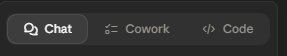
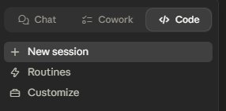
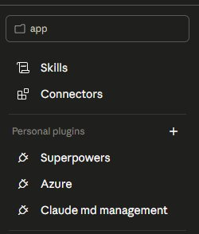
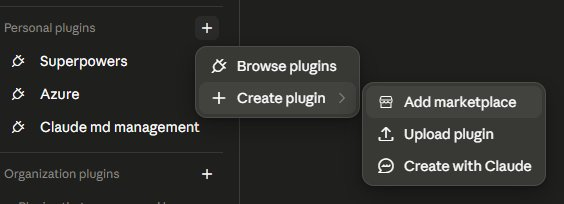
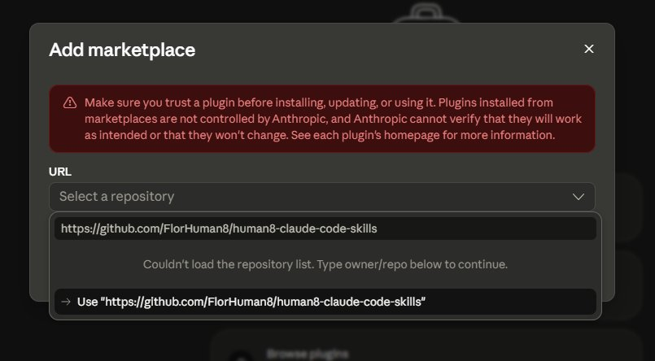
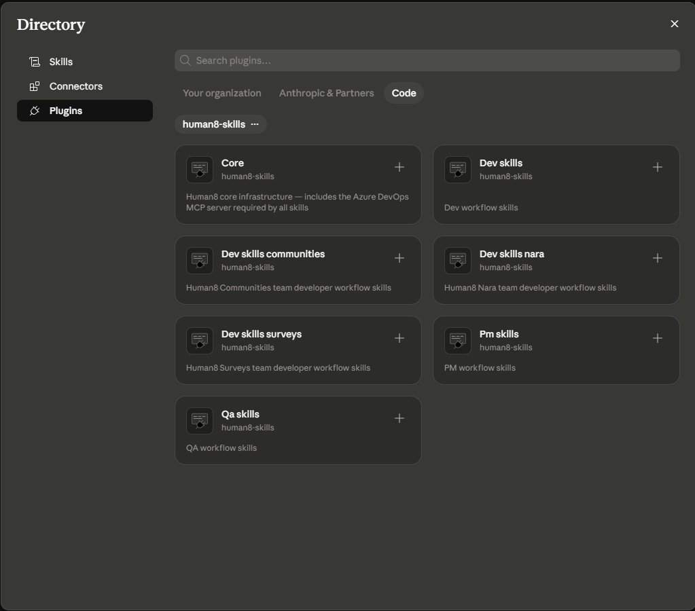

# Human8 Claude Code Skills Library

A shared plugin marketplace of Claude Code skills for Dev, PM and QA teams at Human8. One install command, immediate value for your daily workflow.

## What's inside

### Core plugin

| Plugin | Purpose |
|---|---|
| `core` | Azure DevOps MCP server — required by all other skills |

Install this first. Without it, skills that connect to Azure DevOps won't work.

### Base plugins

| Plugin | Skills |
|---|---|
| `dev-skills` | `create-pr`, `review-pr`, `accessibility-check`, `cs-unit-tests`, `generic-frontend-unit-tests` |
| `pm-skills` | `write-pbi`, `add-acceptance-criteria`, `check-pbi-readiness`, `open-tasks-overview`, `write-user-guide` |
| `qa-skills` | `ado-test-plan`, `azure-devops-create-rework` |

### Team-specific plugins

Each team plugin bundles a complete end-to-end dev workflow and a `tackle` agent that runs the full cycle automatically.

| Plugin | Team | Agent | Team-specific extras |
|---|---|---|---|
| `dev-skills-surveys` | Surveys | `tackle` | `ado-wrap`, `create-bug-from-ticket` |
| `dev-skills-communities` | Communities | `tackle` | `vue-unit-test`, `insites-unit-tests`, `create-bug-from-ticket` |
| `dev-skills-nara` | Nara / Nolvin | `tackle` | `nolvin-unit-tests`, `create-bug-from-ticket` |

All three team plugins share this workflow skill set:

| Skill | What it does |
|---|---|
| `ado-work-item` | Fetch a work item from Azure DevOps and classify its type |
| `investigate-feature` | Understand acceptance criteria for a PBI |
| `investigate-bug` | Find the root cause of a bug |
| `investigate-rework` | Understand what needs to be corrected in a rework task |
| `investigate-task` | Investigate a standalone task from a PBI |
| `investigate-ticket` | Find the root cause of a Service Desk ticket |
| `plan-write` | Write the implementation plan based on investigation findings |
| `branch-setup` | Set up the git branch (and optional worktree) for a work item |
| `execute-plan` | Implement the plan step by step |
| `git-commit` | Stage and commit changes for a work item |
| `create-pr` | Create a pull request (with team-specific conventions) |
| `accessibility-check` | Fix web accessibility issues directly in the code |

## Installation

### Prerequisites

Git must be installed — Claude Code and the plugin marketplace require it. Verify with:

```
git --version
```

---

### Option A — Claude Code Desktop App

**Step 1 — Open the Code section**

In the Claude desktop app, click the **Code** tab in the left sidebar.



**Step 2 — Open Customize**

Click **Customize** to open the configuration panel.



**Step 3 — Open the plugins menu**

Under **Personal plugins**, click the **+** button to open the plugins menu.



**Step 4 — Create plugin → Add marketplace**

Select **Create plugin**, then choose **Add marketplace**.



**Step 5 — Paste the repository URL and sync**

Paste `https://github.com/FlorHuman8/human8-claude-code-skills` and click **Use...** to sync the marketplace.

> **Note:** If you see "Couldn't load the repository list", that's normal — just type the owner/repo URL directly (`FlorHuman8/human8-claude-code-skills`) and continue.



**Step 6 — Install plugins**

Install **Core** first (it includes the Azure DevOps MCP server), then install the plugins for your role.



---

### Option B — Claude Code CLI

Run the following commands in order:

```
/plugin marketplace add FlorHuman8/human8-claude-code-skills
```

Install **Core first** — it includes the Azure DevOps connection:

```
/plugin install core@human8-skills
```

Then install the plugins for your role:

```
/plugin install dev-skills@human8-skills
/plugin install dev-skills-surveys@human8-skills      # Surveys team
/plugin install dev-skills-communities@human8-skills  # Communities team
/plugin install dev-skills-nara@human8-skills         # Nara / Nolvin team
/plugin install pm-skills@human8-skills               # PMs
/plugin install qa-skills@human8-skills               # QA
```

Reload to activate:

```
/reload-plugins
```

---

### Using skills in Claude chat (no CLI required)

Once installed, skills are also available in the general Claude chat — PMs and others can use them without the CLI by typing the skill name or describing the task in natural language.

---

### Troubleshooting

- **"Couldn't load the repository list"** — This is normal. Just type the owner/repo URL (`FlorHuman8/human8-claude-code-skills`) directly instead of browsing the list.
- **Skills don't appear in the `/` menu** — Skills may not always show as autocomplete suggestions, but they still work when typed in full (e.g. `/pm-skills:draft-pbi`) or described in natural language.

## Usage

### `tackle` — full workflow agent

The `tackle` agent handles the complete development cycle end-to-end for a work item:

```
classify → investigate → plan → branch → implement → accessibility check → commit → PR → ADO wrap-up
```

Just give it a work item ID or URL:

```
/dev-skills-nara:tackle
/dev-skills-communities:tackle
/dev-skills-surveys:tackle
```

### Individual skills

Use skills individually when you want to step through the workflow manually or run a specific task:

**Dev workflow (team plugins):**
```
/dev-skills-communities:investigate-bug
/dev-skills-nara:plan-write
/dev-skills-surveys:create-pr
```

**Base dev skills:**
```
/dev-skills:accessibility-check
/dev-skills:cs-unit-tests
/dev-skills:generic-frontend-unit-tests
/dev-skills:create-pr
/dev-skills:review-pr
```

**PM skills:**
```
/pm-skills:write-pbi
/pm-skills:add-acceptance-criteria
/pm-skills:check-pbi-readiness
/pm-skills:open-tasks-overview
/pm-skills:write-user-guide
```

**QA skills:**
```
/qa-skills:ado-test-plan
/qa-skills:azure-devops-create-rework
```

Skills are also available in the general Claude chat — you don't need the CLI. Describe what you want in natural language and Claude will invoke the right skill.

## Repo structure

```
human8-claude-code-skills/
├── .claude-plugin/
│   └── marketplace.json                    # Marketplace catalog
└── plugins/
    ├── core/                               # Azure DevOps MCP server
    │   └── .claude-plugin/plugin.json
    ├── dev-skills/                         # Base dev skills (all teams)
    │   ├── .claude-plugin/plugin.json
    │   └── skills/
    │       ├── create-pr/SKILL.md
    │       ├── review-pr/SKILL.md
    │       ├── accessibility-check/SKILL.md
    │       ├── cs-unit-tests/SKILL.md
    │       └── generic-frontend-unit-tests/SKILL.md
    ├── pm-skills/                          # Product management skills
    │   └── skills/
    │       ├── write-pbi/SKILL.md
    │       ├── add-acceptance-criteria/SKILL.md
    │       ├── check-pbi-readiness/SKILL.md
    │       ├── open-tasks-overview/SKILL.md
    │       └── write-user-guide/SKILL.md
    ├── qa-skills/                          # QA skills
    │   └── skills/
    │       ├── ado-test-plan/SKILL.md
    │       └── azure-devops-create-rework/SKILL.md
    ├── dev-skills-surveys/                 # Surveys team full workflow
    │   ├── agents/tackle.md
    │   └── skills/ ...
    ├── dev-skills-communities/             # Communities team full workflow
    │   ├── agents/tackle.md
    │   └── skills/ ...
    └── dev-skills-nara/                    # Nara / Nolvin team full workflow
        ├── agents/tackle.md
        └── skills/ ...
```

## Contributing

### Adding a skill to an existing plugin

1. Create a folder: `plugins/<plugin-name>/skills/<skill-name>/`
2. Add a `SKILL.md` with frontmatter (`name`, `description`) and the skill instructions
3. Commit and push — teammates pick it up with `/plugin marketplace update human8-skills`

### Adding a team-specific skill

Team plugins can add skills not in the base plugin, or shadow a base skill with the same name for team-specific behaviour:

1. Create the skill under the team plugin: `plugins/dev-skills-<team>/skills/<skill-name>/SKILL.md`
2. Use the same frontmatter format as the base skill
3. For overrides: keep generic steps, add team-specific conventions on top

### Adding an agent

1. Create a `.md` file under `plugins/<plugin-name>/agents/<agent-name>.md`
2. Add frontmatter with `name`, `description`, and `model`
3. Write a system prompt that orchestrates the relevant skills

## About

Built at the Human8 hackathon. Skills are atomic — one skill, one task — and designed to chain into larger workflows. The `tackle` agent orchestrates these chains automatically. Team-specific plugins let each team add their own conventions without forking the shared base. The library grows over time as teams discover new use cases.
